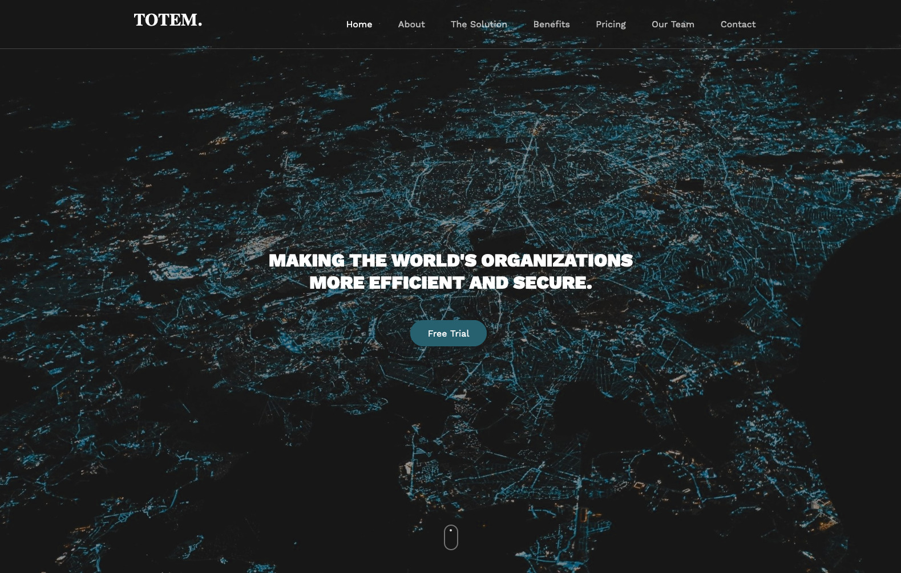

# 최근 업데이트

사용 가능 언어   Flutter, Native Code, Swift | C++, .Net Core Form, Java | JSP, Spring | BashShell script, Powershell Script  
사용 가능 IDE   IntelliJ IDEA 2020 | Visual studio 2017 | Eclipse | Android Studio | XCode 
사용 가능 OS    Windows Pro | MacOS Catalina | Centos 7.xx 8.xx 

해외 기술학술자료, API 원문 해석 및 응용 문제가 없습니다.

1. Totem Computing ( Web, Program )
https://macleeinn.github.io/ 

